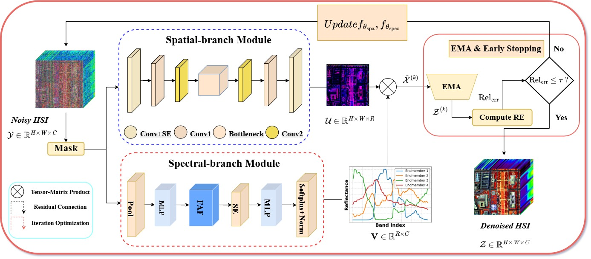
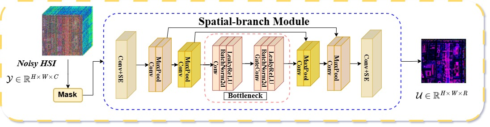
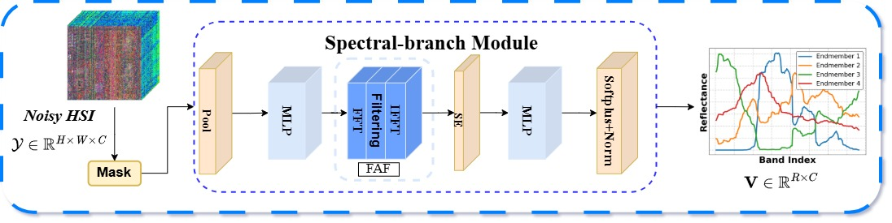
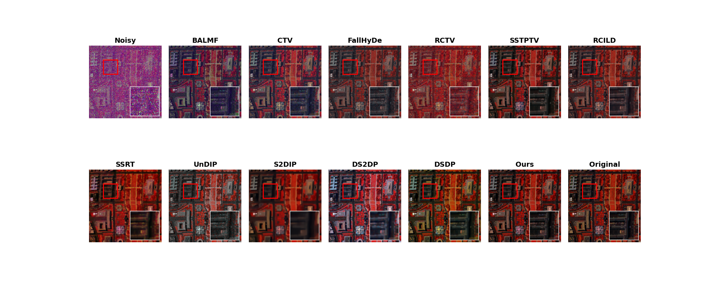
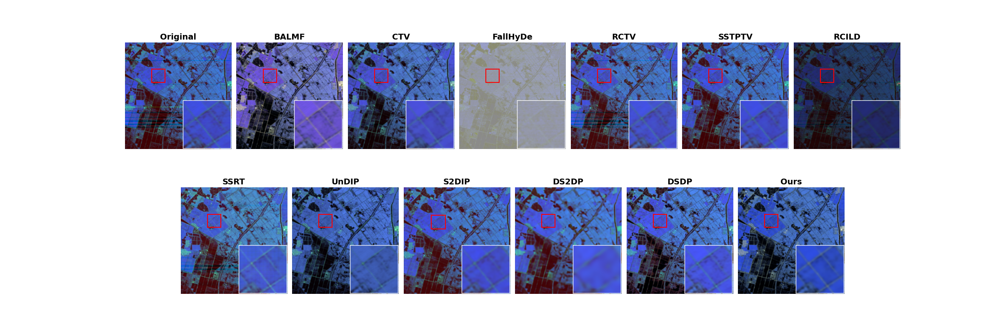

# Self-Supervised Hyperspectral Image Denoising via Deep Spatial-Spectral-Frequency Decoupled Prior

 

**Weizhen Sun, Qiang Zhang, Wenjing Gao, Zishuo Wang, Tongde Yang, Yi Xiao**

**[Center of Hyperspectral Imaging in Remote Sensing (CHIRS), Dalian Maritime University]**

> **Abstract:** Hyperspectral image (HSI) is inevitably corrupted by various noises during acquisition, which severely degrade subsequent quantitative analysis and applications. Existing supervised HSI denoising methods heavily rely on large-scale clean datasets, usually suffering from overfitting and limited generalization. To address these limitations, this work proposes a novel self-supervised HSI denoising framework driven by a deep spatial-spectral-frequency decoupled (SSFD) prior. First, inspired by the physical mechanisms of the hyperspectral linear mixing model, a dual-branch parallel architecture is constructed for spatial-spectral decoupling. It transforms high-dimensional image reconstruction into a low-rank factorization process, where the deep prior imposes strong physical constraints on noise modeling. Second, to mitigate the instability of endmember estimation, a frequency-domain adaptive filtering (FAF) module is introduced with learnable weights. By exploiting the spectral discrepancies between signals and noise, the FAF module precisely modulates abnormal frequency components in the complex domain. Finally, a mask-based self-supervised learning strategy is adopted. Leveraging the inherent spatial-spectral-frequency redundancy of HSIs, the proposed method effectively prevents the identity mapping of noise, facilitating blind HSI denoising without clean ground-truth data. Extensive experiments demonstrate that SSFD consistently outperforms state-of-the-art approaches.

## 🚀 Network Architecture

  

  <em>Figure 1: Overall architecture of the proposed SSFD framework.</em>

  

  <em>Figure 2:  Architecture of the spatial branch module.</em>

  

  <em>Figure 3: Architecture of the spectral branch module.</em>

## 🛠️ Prerequisites

- Python 3.10
- PyTorch torch-2.0.1+cu117、torchvision-0.15.2+cu117
- NVIDIA GPU + CUDA cuDNN

## 📂 Data Preparation
Since SSFD is a purely self-supervised method, it requires NO 
clean ground-truth data for pre-training. You can directly optimize 
the network on the target noisy observation.

Please download the standard HSI datasets (e.g., Pavia University, Washington DC Mall) 
and place the .mat files in the data/ folder as follows:

## 💻 Usage

Denoising (Self-Supervised Optimization)

To denoise an HSI using the proposed SSFD model, 
simply run the optimization script on your target image.

### Example: Denoise the WDC dataset
python train.py

### Example: Denoise the ZY1 02D dataset
python train_ZY.py

## 📊 Visual Results

<em>Figure 4: Visual comparison of denoised results on the WDC dataset (Case 6: severe mixed noise).</em>

<em>Figure 5: Visual comparison of denoised results on the ZY1 02D dataset. </em>

## 📝 Citation

## 📧 Contact
If you have any questions or suggestions, 
please feel free to open an issue or contact Weizhen Sun at sunweizhennb@163.com.

